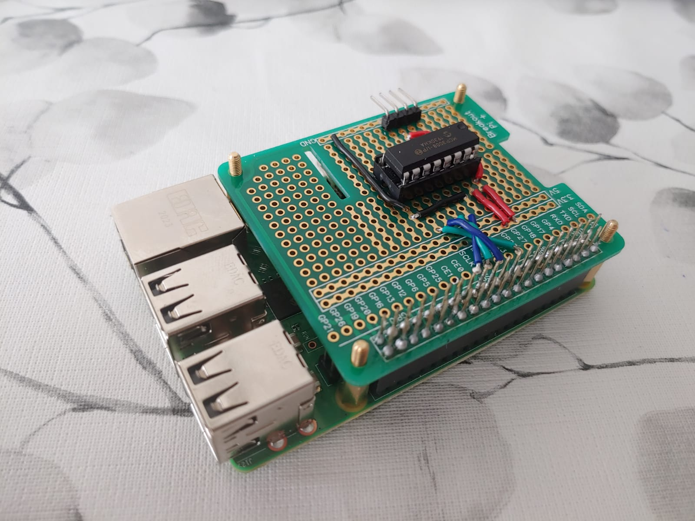

# Keuzevak-IoT Save the Plants
Voor het het keuzevak Internet of Things moet er een relatief simpel IoT project gerealiseerd worden. Ik heb gekozen voor het monitoren van de vochtigheid van de potgrond van planten. Als deze te laag is zal er een notificatie gezonden worden naar mijn telefoon.
# Probleem- en doelstelling
Mijn vriendin en ik vinden bloemen en planten erg mooi maar verdomd moeilijk om in leven te houden. Vandaar wil ik dit project gebruiken om wat meer te leren over hoevaak een plant water moet krijgen en dus de toekomstige aangeschafte bloemen/planten een langer leven geven. Het product wat gerealiseerd wordt houd dus de vochtigheid van de potgrond bij en geeft een notificatie wanneer deze te laag is. Het idee is dat dit product dan een maand gebruikt kan worden bij een plant om het bewaterings schema te achterhalen. Vervolgens kan de volgende plant bijgehouden worden en het bewaterings schema opgeslagen worden voor reguliere notificaties.
# Hardware
Voor dit project worden de volgende spullen gebruikt
 * Raspberry Pi 3 model B+
 * Grove - Capacitive Moisture Sensor
 * Grove - 4 pin Female Jumper to Grove 4 pin Conversion Cable
 * MCP3008 - 8-kanaals ADC met SPI-interface
 * Spullen voor shield/hat
 
Er is voor een capacitieve sensor gekozen omdat deze niet corroderen na lang gebruik. Hier horen de juiste kabels bij. De MCP3008 is nodig omdat de sensor een analoge output heeft. deze kan de Raspberry niet uitlezen. Deze elektronica zal waarschijnlijk eerst op een breadboard getest worden, als alles werkt wordt het gesoldeerd op een shield/hat voor de Raspberry.

# Raspberry setup
Door gebruik te maken van de imager van raspberry pi zelf was het erg simpel raspian op raspberry te zetten.

# Hello World
Eerste proramma wat veel gebruikt wordt in de code wereld is een "Hello World" programma. Hierbij was dat niet helemaal van toepassing, in plaats daarvan heb ik een klein stukje code geschreven dat een ledje laat knipperen. Hieronder is de test te zien.

Daarna is er ook nog een knop aan toegevoed om te kijken of daarmee het ledje aangezet kan worden. Dat is hieronder te zien.

# Analog to digital
Om het analoge signaal naar digitaal om te zetten wordt er gebruik gemaakt van een MCP3008 op adafruit stond er een voorbeeldje voor code om een potmeter uit te lezen met deze chip. Ik heb dit voorbeeldje na gemaakt en het werkt allemaal naar behoren. Vervolgens heb ik de sensor aangesloten op de pin waar de potmeter was aangesloten en een glas water gepakt. Om te kijken of er verschillende waardes uitkwamen. Dit was ook het geval. Ook had ik ergens gelezen dat het mogelijk was voor water om tussen de lagen van de pcb te komen op de lange duur. Om dit te voorkomen kun je nagellak op de raden van de pcb smeren. Dus had mijn zusje lief gevraagd of ik wat van haar nagelak kon lenen.

# Thinger.io
Na wat onderzoek gedaan te hebben over dashboards voor data kwam ik uit op Thinger.io. Na een dag prielen met de code heb ik het voor elkaar gekregen om met mijn telefoon een lampje aan en uit te zetten en een knop uit te lezen. Mijn volgende stap zou dan zijn het uitlezen van de sensor. Alleen de thinger.io client is een C++ maar de sensor uitlezen is in python. Dat gaat moeilijk samen en om in plaats van moeilijk te doen om het werkend te krijgen heb ik ervoor gekozen om een ander data dashboard te gebruiken. In de lessen werdt er aanbevolen om thingspeak te gebruiken dus ik ben hier mee verder gegaan.

# Teamspeak
Ik maakte een teamspeak account aan en zocht naar een test programmatje wat ik kon gebruiken om te kijken of het allemaal werkte. Ik had er een gevonden, deze is te vinden in de software map genaamd cpu.py. Deze stuurt elke 15 seconde de cpu temperatuur naar teamspeak. Ik moest alleen de key van mijn channel in te vullen en het delay van 15 seconde in programeren en het werkte.
Volgende stap was om een conversie te doen van de spanning die gemeten wordt door de raspberry naar het daadwerkelijk vochtgehalte van de grond. Hiervoor heb ik een mooi artikel gevonden die het stap voor stap uitlegt. Om het goed te berekenen heb ik eigenlijk een test plant nodig om daar wat grond van te pakken om de sensor mee te eiken. Die heb ik nog niet dus heb gekeken hoe de algemene vergelijking er uit ziet en die in de software gezet. de conversie was dus geimlementeerd maar had nog niet de juiste waardes. Die komen later wel
Nu kon ik het verzenden van data naar teamspeak implementeren in het sensor programma. Ik had het deel van het programma wat de data verzond gekopieerd en geplakt alleen gaf deze nu errors. Het probleem was dat cpu.py in python2 staat geschreven en het sensor programma in python3. Gelukkig betekende dat alleen dat er van librarys anders genoemd moesten worden. Na dat alles aangepast was werkte het gewoon naar behoren.

# Hat
Nu dit allemaal goed werkt is alle elektronica op een lege hat voor raspberry gesoldeerd zodat het er allemaal van netje uit ziet en wat robuster is.

# Senor eiken
Bij de Jumbo vond ik een mooi plantje, een kalanchoe. Dat leek me een mooie kandidaat voor mijn experiment. Toen ik hem gekocht had viel me helaas pas op dat het een vetplant is en dus helemaal niet zo vee water nodig heeft. Dan maar hopen dat me vriendin hem gewoon mooi vind. Thuis heb ik de plant uit de pot gehaald en wat grond van de onderkant gehaald. Deze grond op een in aluminium gewikkelde kartonnen plaat gelegd en in de oven op 50 graden tot deze kurk droog is.
