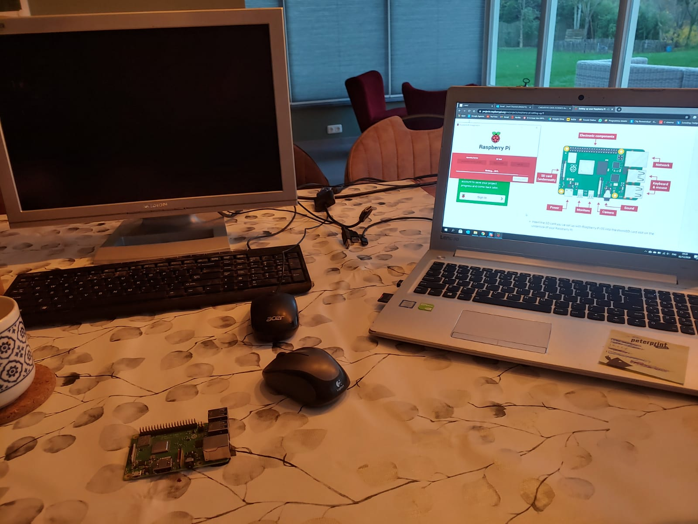
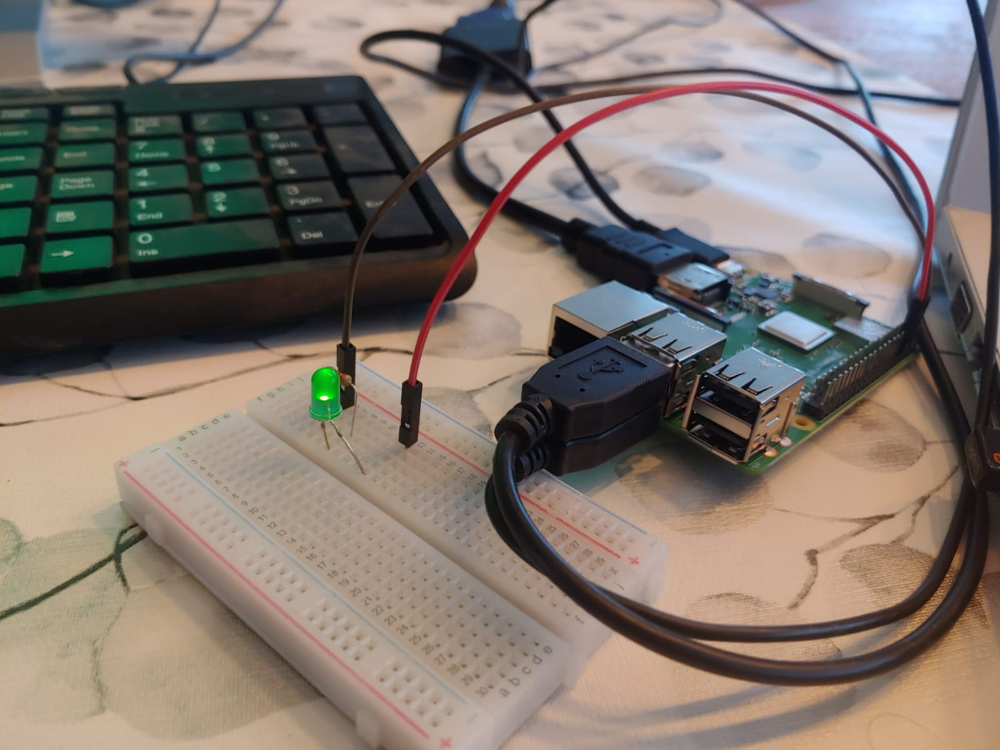
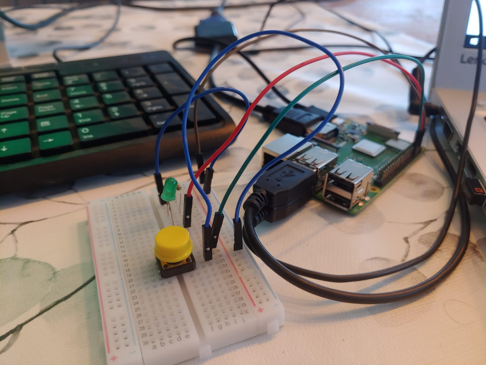

# Keuzevak-IoT Save the Plants
Voor het het keuzevak Internet of Things moet er een relatief simpel IoT project gerealiseerd worden. Ik heb gekozen voor het monitoren van de vochtigheid van de potgrond van planten. Als deze te laag is zal er een notificatie gezonden worden naar mijn telefoon.
# Probleem- en doelstelling
Mijn vriendin en ik vinden bloemen en planten erg mooi maar verdomd moeilijk om in leven te houden. Vandaar wil ik dit project gebruiken om wat meer te leren over hoevaak een plant water moet krijgen en dus de toekomstige aangeschafte bloemen/planten een langer leven geven. Het product wat gerealiseerd wordt houd dus de vochtigheid van de potgrond bij en geeft een notificatie wanneer deze te laag is. Het idee is dat dit product dan een maand gebruikt kan worden bij een plant om het bewaterings schema te achterhalen. Vervolgens kan de volgende plant bijgehouden worden en het bewaterings schema opgeslagen worden voor reguliere notificaties.
# Hardware
Voor dit project worden de volgende spullen gebruikt
 * Raspberry Pi 3 model B+
 * Grove - Capacitive Moisture Sensor
 * Grove - 4 pin Female Jumper to Grove 4 pin Conversion Cable
 * MCP3008 - 8-kanaals ADC met SPI-interface
 * Spullen voor shield/hat
 
Er is voor een capacitieve sensor gekozen omdat deze niet corroderen na lang gebruik. Hier horen de juiste kabels bij. De MCP3008 is nodig omdat de sensor een analoge output heeft. deze kan de Raspberry niet uitlezen. Deze elektronica zal waarschijnlijk eerst op een breadboard getest worden, als alles werkt wordt het gesoldeerd op een shield/hat voor de Raspberry.

# Raspberry setup
Door gebruik te maken van de imager van raspberry pi zelf was het erg simpel raspian op raspberry te zetten.

# Hello World
Eerste proramma wat veel gebruikt wordt in de code wereld is een "Hello World" programma. Hierbij was dat niet helemaal van toepassing, in plaats daarvan heb ik een klein stukje code geschreven dat een ledje laat knipperen. Hieronder is de test te zien.

Daarna is er ook nog een knop aan toegevoed om te kijken of daarmee het ledje aangezet kan worden. Dat is hieronder te zien.

# Thinger.io
Na wat onderzoek gedaan te hebben over dashboards voor data kwam ik uit op Thinger.io. Na een dag prielen met de code heb ik het voor elkaar gekregen om met mijn telefoon een lampje aan en uit te zetten en een knop uit te lezen. Mijn volgende stap zou dan zijn het uitlezen van de sensor. Alleen de thinger.io client is een C++ maar de sensor uitlezen is in python. Dat gaat moeilijk samen en om in plaats van moeilijk te doen om het werkend te krijgen heb ik ervoor gekozen om een ander data dashboard te gebruiken. In de lessen werdt er aanbevolen om thingspeak te gebruiken dus ik ben hier mee verder gegaan.
